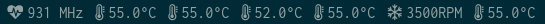
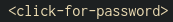
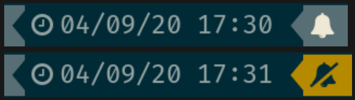
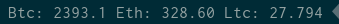
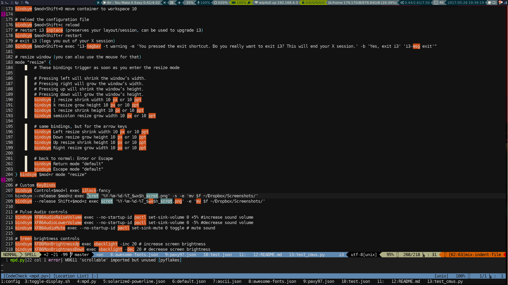
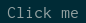
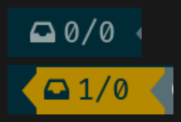
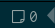
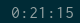

.. THIS DOCUMENT IS AUTO-GENERATED, DO NOT MODIFY
.. To change this document, please update the docstrings in the individual modules
List of modules
===============

core
----


cpu
~~~

Displays CPU utilization across all CPUs.

By default, opens `gnome-system-monitor` on left mouse click.

Requirements:
    * the psutil Python module for the first three items from the list above
    * gnome-system-monitor for default mouse click action

Parameters:
    * cpu.warning : Warning threshold in % of CPU usage (defaults to 70%)
    * cpu.critical: Critical threshold in % of CPU usage (defaults to 80%)
    * cpu.format  : Format string (defaults to '{:.01f}%')
    * cpu.percpu  : If set to true, show each individual cpu (defaults to false)


date
~~~~

Displays the current date and time.

Parameters:
    * date.format: strftime()-compatible formatting string
    * date.locale: locale to use rather than the system default

.. image:: ../screenshots/date.png

datetime
~~~~~~~~

Displays the current date and time.

Parameters:
    * datetime.format: strftime()-compatible formatting string
    * datetime.locale: locale to use rather than the system default


debug
~~~~~

Shows that debug is enabled

disk
~~~~

Shows free diskspace, total diskspace and the percentage of free disk space.

Parameters:
    * disk.warning: Warning threshold in % of disk space (defaults to 80%)
    * disk.critical: Critical threshold in % of disk space (defaults to 90%)
    * disk.path: Path to calculate disk usage from (defaults to /)
    * disk.open: Which application / file manager to launch (default xdg-open)
    * disk.format: Format string, tags {path}, {used}, {left}, {size} and {percent} (defaults to '{path} {used}/{size} ({percent:05.02f}%)')
    * disk.system: Unit system to use - SI (KB, MB, ...) or IEC (KiB, MiB, ...) (defaults to 'IEC')


error
~~~~~

Shows bumblebee-status errors

git
~~~

Print the branch and git status for the
currently focused window.

Requires:
    * xcwd
    * Python module 'pygit2'


keys
~~~~

Shows when a key is pressed

Parameters:
    * keys.keys: Comma-separated list of keys to monitor (defaults to "")

layout
~~~~~~

Displays the current keyboard layout using libX11

Requires the following library:
    * libX11.so.6
and python module:
    * xkbgroup

Parameters:
    * layout-xkb.showname: Boolean that indicate whether the full name should be displayed. Defaults to false (only the symbol will be displayed)
    * layout-xkb.show_variant: Boolean that indecates whether the variant name should be displayed. Defaults to true.

.. image:: ../screenshots/layout.png

layout-xkb
~~~~~~~~~~

Displays the current keyboard layout using libX11

Requires the following library:
    * libX11.so.6
and python module:
    * xkbgroup

Parameters:
    * layout-xkb.showname: Boolean that indicate whether the full name should be displayed. Defaults to false (only the symbol will be displayed)
    * layout-xkb.show_variant: Boolean that indecates whether the variant name should be displayed. Defaults to true.

layout_xkb
~~~~~~~~~~

Displays the current keyboard layout using libX11

Requires the following library:
    * libX11.so.6
and python module:
    * xkbgroup

Parameters:
    * layout-xkb.showname: Boolean that indicate whether the full name should be displayed. Defaults to false (only the symbol will be displayed)
    * layout-xkb.show_variant: Boolean that indecates whether the variant name should be displayed. Defaults to true.

load
~~~~

Displays system load.

By default, opens `gnome-system-monitor` on left mouse click.

Requirements:
    * gnome-system-monitor for default mouse click action

Parameters:
    * load.warning : Warning threshold for the one-minute load average (defaults to 70% of the number of CPUs)
    * load.critical: Critical threshold for the one-minute load average (defaults to 80% of the number of CPUs)


memory
~~~~~~

Displays available RAM, total amount of RAM and percentage available.

By default, opens `gnome-system-monitor` on left mouse click.

Requirements:
    * gnome-system-monitor for default mouse click action

Parameters:
    * memory.warning : Warning threshold in % of memory used (defaults to 80%)
    * memory.critical: Critical threshold in % of memory used (defaults to 90%)
    * memory.format: Format string (defaults to '{used}/{total} ({percent:05.02f}%)')
    * memory.usedonly: Only show the amount of RAM in use (defaults to False). Same as memory.format='{used}'


nic
~~~

Displays the name, IP address(es) and status of each available network interface.

Requires the following python module:
    * netifaces

Requires the following executable:
    * iw
    * (until and including 2.0.5: iwgetid)

Parameters:
    * nic.exclude: Comma-separated list of interface prefixes (supporting regular expressions) to exclude (defaults to 'lo,virbr,docker,vboxnet,veth,br,.*:avahi')
    * nic.include: Comma-separated list of interfaces to include
    * nic.states: Comma-separated list of states to show (prefix with '^' to invert - i.e. ^down -> show all devices that are not in state down)
    * nic.format: Format string (defaults to '{intf} {state} {ip} {ssid} {strength}')
    * nic.strength_warning: Integer to set the threshold for warning state (defaults to 50)
    * nic.strength_critical: Integer to set the threshold for critical state (defaults to 30)


ping
~~~~

Periodically checks the RTT of a configurable host using ICMP echos

Requires the following executable:
    * ping

Parameters:
    * ping.address : IP address to check
    * ping.timeout : Timeout for waiting for a reply (defaults to 5.0)
    * ping.probes  : Number of probes to send (defaults to 5)
    * ping.warning : Threshold for warning state, in seconds (defaults to 1.0)
    * ping.critical: Threshold for critical state, in seconds (defaults to 2.0)


pulseaudio
~~~~~~~~~~

Displays volume and mute status and controls for PulseAudio devices. Use wheel up and down to change volume, left click mutes, right click opens pavucontrol.

!!! This module will eventually be deprecated (since it has bad performance and high CPU load) and be replaced with "pulsectl", which is a much better drop-in replacement !!!

Aliases: pasink (use this to control output instead of input), pasource

Parameters:
    * pulseaudio.autostart: If set to 'true' (default is 'false'), automatically starts the pulseaudio daemon if it is not running
    * pulseaudio.percent_change: How much to change volume by when scrolling on the module (default is 2%)
    * pulseaudio.limit: Upper limit for setting the volume (default is 0%, which means 'no limit')
      Note: If the left and right channels have different volumes, the limit might not be reached exactly.
    * pulseaudio.showbars: 1 for showing volume bars, requires --markup=pango;
      0 for not showing volume bars (default)
    * pulseaudio.showdevicename: If set to 'true' (default is 'false'), the currently selected default device is shown.
      Per default, the sink/source name returned by "pactl list sinks short" is used as display name.

      As this name is usually not particularly nice (e.g "alsa_output.usb-Logitech_Logitech_USB_Headset-00.analog-stereo"),
      its possible to map the name to more a user friendly name.

      e.g to map "alsa_output.usb-Logitech_Logitech_USB_Headset-00.analog-stereo" to the name "Headset", add the following
      bumblebee-status config entry: pulseaudio.alsa_output.usb-Logitech_Logitech_USB_Headset-00.analog-stereo=Headset

      Furthermore its possible to specify individual (unicode) icons for all sinks/sources. e.g in order to use the icon 🎧 for the
      "alsa_output.usb-Logitech_Logitech_USB_Headset-00.analog-stereo" sink, add the following bumblebee-status config entry:
      pulseaudio.icon.alsa_output.usb-Logitech_Logitech_USB_Headset-00.analog-stereo=🎧
    * Per default a left mouse button click mutes/unmutes the device. In case you want to open a dropdown menu to change the current
      default device add the following config entry to your bumblebee-status config: pulseaudio.left-click=select_default_device_popup

Requires the following executable:
    * pulseaudio
    * pactl
    * pavucontrol


pulsectl
~~~~~~~~

Displays volume and mute status and controls for PulseAudio devices. Use wheel up and down to change volume, left click mutes, right click opens pavucontrol.

**Please prefer this module over the "pulseaudio" module, which will eventually be deprecated

Aliases: pulseout (for outputs, such as headsets, speakers), pulsein (for microphones)

NOTE: Do **not** use this module directly, but rather use either pulseout or pulsein!
NOTE2: For the parameter names below, please also use pulseout or pulsein, instead of pulsectl

Parameters:
    * pulsectl.autostart: If set to 'true' (default is 'false'), automatically starts the pulsectl daemon if it is not running
    * pulsectl.percent_change: How much to change volume by when scrolling on the module (default is 2%)
    * pulsectl.limit: Upper limit for setting the volume (default is 0%, which means 'no limit')
    * pulsectl.showbars: 'true' for showing volume bars, requires --markup=pango;
      'false' for not showing volume bars (default)
    * pulsectl.showdevicename: If set to 'true' (default is 'false'), the currently selected default device is shown.
      Per default, the sink/source name returned by "pactl list sinks short" is used as display name.

      As this name is usually not particularly nice (e.g "alsa_output.usb-Logitech_Logitech_USB_Headset-00.analog-stereo"),
      its possible to map the name to more a user friendly name.

      e.g to map "alsa_output.usb-Logitech_Logitech_USB_Headset-00.analog-stereo" to the name "Headset", add the following
      bumblebee-status config entry: pulsectl.alsa_output.usb-Logitech_Logitech_USB_Headset-00.analog-stereo=Headset

      Furthermore its possible to specify individual (unicode) icons for all sinks/sources. e.g in order to use the icon 🎧 for the
      "alsa_output.usb-Logitech_Logitech_USB_Headset-00.analog-stereo" sink, add the following bumblebee-status config entry:
      pulsectl.icon.alsa_output.usb-Logitech_Logitech_USB_Headset-00.analog-stereo=🎧
    * Per default a left mouse button click mutes/unmutes the device. In case you want to open a dropdown menu to change the current
      default device add the following config entry to your bumblebee-status config: pulsectl.left-click=select_default_device_popup

Requires the following Python module:
    * pulsectl

redshift
~~~~~~~~

Displays the current color temperature of redshift

Requires the following executable:
    * redshift

Parameters:
    * redshift.location : location provider, either of 'auto' (default), 'geoclue2',
      'ipinfo' or 'manual'
      'auto' uses whatever redshift is configured to do
    * redshift.lat : latitude if location is set to 'manual'
    * redshift.lon : longitude if location is set to 'manual'
    * redshift.show_transition: information about the transitions (x% day) defaults to True
    * redshift.adjust: set this to 'true' (defaults to false) to let bumblebee-status adjust color temperature, instead of just showing the current settings

.. image:: ../screenshots/redshift.png

scroll
~~~~~~

Displays two widgets that can be used to scroll the whole status bar

Parameters:
    * scroll.width: Width (in number of widgets) to display

sensors2
~~~~~~~~

Displays sensor temperature and CPU frequency

Parameters:

    * sensors2.chip: 'sensors -u' compatible filter for chip to display (default to empty - show all chips)
    * sensors2.showcpu: Enable or disable CPU frequency display (default: true)
    * sensors2.showtemp: Enable or disable temperature display (default: true)
    * sensors2.showfan: Enable or disable fan display (default: true)
    * sensors2.showother: Enable or display 'other' sensor readings (default: false)
    * sensors2.showname: Enable or disable show of sensor name (default: false)
    * sensors2.chip_include: Comma-separated list of chip to include (defaults to '' will include all by default, example: 'coretemp,bat')
    * sensors2.chip_exclude:Comma separated list of chip to exclude (defaults to '' will exclude none by default)
    * sensors2.field_include: Comma separated list of chip to include (defaults to '' will include all by default, example: 'temp,fan')
    * sensors2.field_exclude: Comma separated list of chip to exclude (defaults to '' will exclude none by default)
    * sensors2.chip_field_exclude: Comma separated list of chip field to exclude (defaults to '' will exclude none by default, example: 'coretemp-isa-0000.temp1,coretemp-isa-0000.fan1')
    * sensors2.chip_field_include: Comma-separated list of adaper field to include (defaults to '' will include all by default)



spacer
~~~~~~

Draws a widget with configurable text content.

Parameters:
    * spacer.text: Widget contents (defaults to empty string)

.. image:: ../screenshots/spacer.png

speedtest
~~~~~~~~~

Performs a speedtest - only updates when the "play" button is clicked

Requires the following python module:
    * speedtest-cli

test
~~~~

Test module

time
~~~~

Displays the current date and time.

Parameters:
    * time.format: strftime()-compatible formatting string
    * time.locale: locale to use rather than the system default

.. image:: ../screenshots/time.png

vault
~~~~~

Copy passwords from a password store into the clipboard (currently supports only 'pass')

Many thanks to [@bbernhard](https://github.com/bbernhard) for the idea!

Requires the following executable:
    * pass (aka password-store)

Parameters:
    * vault.duration: Duration until password is cleared from clipboard (defaults to 30)
    * vault.location: Location of the password store (defaults to ~/.password-store)
    * vault.offx: x-axis offset of popup menu (defaults to 0)
    * vault.offy: y-axis offset of popup menu (defaults to 0)
    * vault.text: Text to display on the widget (defaults to <click-for-password>)

Many thanks to `bbernhard <https://github.com/bbernhard>`_ for the idea!



xrandr
~~~~~~

Shows a widget for each connected screen and allows the user to enable/disable screens.

Parameters:
    * xrandr.overwrite_i3config: If set to 'true', this module assembles a new i3 config
      every time a screen is enabled or disabled by taking the file '~/.config/i3/config.template'
      and appending a file '~/.config/i3/config.<screen name>' for every screen.
    * xrandr.autoupdate: If set to 'false', does *not* invoke xrandr automatically. Instead, the
      module will only refresh when displays are enabled or disabled (defaults to true)
    * xrandr.exclude: Comma-separated list of display name prefixes to exclude
    * xrandr.autotoggle: Boolean flag to automatically enable new displays (defaults to false)
    * xrandr.autotoggle_side: Which side to put autotoggled displays on ('right' or 'left', defaults to 'right')

Requires the following python module:
    * (optional) i3 - if present, the need for updating the widget list is auto-detected

Requires the following executable:
    * xrandr

.. image:: ../screenshots/xrandr.png

contrib
-------


amixer
~~~~~~

get volume level or control it

Requires the following executable:
    * amixer

Parameters:
    * amixer.device: Device to use (default is Master,0)
    * amixer.percent_change: How much to change volume by when scrolling on the module (default is 4%)

contributed by `zetxx <https://github.com/zetxx>`_ - many thanks!

input handling contributed by `ardadem <https://github.com/ardadem>`_ - many thanks!

.. image:: ../screenshots/amixer.png

apt
~~~

Displays APT package update information (<to upgrade>/<to remove >)
Requires the following packages:

    * aptitude

contributed by `qba10 <https://github.com/qba10>`_ - many thanks!

arandr
~~~~~~

Enables handy interaction with arandr for display management.  Left-clicking
will execute arandr for interactive display management.  Right-clicking will
bring up a context- and state-sensitive menu that will allow you to switch to a
saved screen layout as well as toggle on/off individual connected displays.

Parameters:
    * No configuration parameters

Requires the following python modules:
    * tkinter

Requires the following executable:
    * arandr
    * xrandr

contributed by `zerorust <https://github.com/zerorust>`_ - many thanks!

arch-update
~~~~~~~~~~~

Check updates to Arch Linux.

Requires the following executable:
    * checkupdates (from pacman-contrib)

contributed by `lucassouto <https://github.com/lucassouto>`_ - many thanks!

.. image:: ../screenshots/arch-update.png

arch_update
~~~~~~~~~~~

Check updates to Arch Linux.

Requires the following executable:
    * checkupdates (from pacman-contrib)

contributed by `lucassouto <https://github.com/lucassouto>`_ - many thanks!

aur-update
~~~~~~~~~~

Check updates for AUR.

Requires the following executable:
    * yay (https://github.com/Jguer/yay)

contributed by `ishaanbhimwal <https://github.com/ishaanbhimwal>`_ - many thanks!


battery
~~~~~~~

Displays battery status, remaining percentage and charging information.

Parameters:
    * battery.device              : Comma-separated list of battery devices to read information from (defaults to auto for auto-detection)
    * battery.warning             : Warning threshold in % of remaining charge (defaults to 20)
    * battery.critical            : Critical threshold in % of remaining charge (defaults to 10)
    * battery.showdevice          : If set to 'true', add the device name to the widget (defaults to False)
    * battery.decorate            : If set to 'false', hides additional icons (charging, etc.) (defaults to True)
    * battery.showpowerconsumption: If set to 'true', show current power consumption (defaults to False)
    * battery.compact-devices     : If set to 'true', compacts multiple batteries into a single entry (default to False)

(partially) contributed by `martindoublem <https://github.com/martindoublem>`_ - many thanks!


battery-upower
~~~~~~~~~~~~~~

Displays battery status, remaining percentage and charging information.

Parameters:
    * battery-upower.warning      : Warning threshold in % of remaining charge (defaults to 20)
    * battery-upower.critical     : Critical threshold in % of remaining charge (defaults to 10)
    * battery-upower.showremaining : If set to true (default) shows the remaining time until the batteries are completely discharged

contributed by `martindoublem <https://github.com/martindoublem>`_ - many thanks!

battery_upower
~~~~~~~~~~~~~~

Displays battery status, remaining percentage and charging information.

Parameters:
    * battery-upower.warning      : Warning threshold in % of remaining charge (defaults to 20)
    * battery-upower.critical     : Critical threshold in % of remaining charge (defaults to 10)
    * battery-upower.showremaining : If set to true (default) shows the remaining time until the batteries are completely discharged

contributed by `martindoublem <https://github.com/martindoublem>`_ - many thanks!

bluetooth
~~~~~~~~~

Displays bluetooth status (Bluez). Left mouse click launches manager app `blueman-manager`,
right click toggles bluetooth. Needs dbus-send to toggle bluetooth state.

Parameters:
    * bluetooth.device : the device to read state from (default is hci0)
    * bluetooth.manager : application to launch on click (blueman-manager)
    * bluetooth.dbus_destination : dbus destination (defaults to org.blueman.Mechanism)
    * bluetooth.dbus_destination_path : dbus destination path (defaults to /)
    * bluetooth.right_click_popup : use popup menu when right-clicked (defaults to True)

contributed by `brunosmmm <https://github.com/brunosmmm>`_ - many thanks!


bluetooth2
~~~~~~~~~~

Displays bluetooth status. Left mouse click launches manager app `blueman-manager`,
right click toggles bluetooth. Needs dbus-send to toggle bluetooth state and
python-dbus to count the number of connections

Parameters:
    * bluetooth.manager : application to launch on click (blueman-manager)

contributed by `martindoublem <https://github.com/martindoublem>`_ - many thanks!

blugon
~~~~~~

Displays temperature of blugon and Controls it.

Use wheel up and down to change temperature, middle click to toggle and right click to reset temperature.

Default Values:
    * Minimum temperature: 1000 (red)
    * Maximum temperature: 20000 (blue)
    * Default temperature: 6600

Requires the following executable:
    * blugon

Parameters:
    * blugon.step: The amount of increase/decrease on scroll (default: 200)

contributed by `DTan13 <https://github.com/DTan13>`

brightness
~~~~~~~~~~

Displays the brightness of a display

The following executables can be used if `use_acpi` is not enabled:
    * brightnessctl
    * light
    * xbacklight

Parameters:
    * brightness.step: The amount of increase/decrease on scroll in % (defaults to 2)
    * brightness.device_path: The device path (defaults to /sys/class/backlight/intel_backlight), can contain wildcards (in this case, the first matching path will be used); This is only used when brightness.use_acpi is set to true
    * brightness.use_acpi: If set to true, read brightness directly from the sys ACPI interface, using the device specified in brightness.device_path (defaults to false)

contributed by `TheEdgeOfRage <https://github.com/TheEdgeOfRage>`_ - many thanks!


caffeine
~~~~~~~~

Enable/disable automatic screen locking.

Requires the following executables:
    * xdg-screensaver
    * xdotool
    * xprop (as dependency for xdotool)
    * notify-send

contributed by `TheEdgeOfRage <https://github.com/TheEdgeOfRage>`_ - many thanks!


cmus
~~~~

Displays information about the current song in cmus.

Requires the following executable:
    * cmus-remote

Parameters:
    * cmus.format: Format string for the song information. Tag values can be put in curly brackets (i.e. {artist})

      Additional tags:
        * {file} - full song file name
        * {file1} - song file name without path prefix
          if {file} = '/foo/bar.baz', then {file1} = 'bar.baz'
        * {file2} - song file name without path prefix and extension suffix
          if {file} = '/foo/bar.baz', then {file2} = 'bar'
    * cmus.layout: Space-separated list of widgets to add. Possible widgets are the buttons/toggles cmus.prev, cmus.next, cmus.shuffle and cmus.repeat, and the main display with play/pause function cmus.main.
    * cmus.server: The address of the cmus server, either a UNIX socket or host[:port]. Connects to the local instance by default.
    * cmus.passwd: The password to use for the TCP/IP connection.

contributed by `TheEdgeOfRage <https://github.com/TheEdgeOfRage>`_ - many thanks!


cpu2
~~~~

Multiwidget CPU module

Can display any combination of:

    * max CPU frequency
    * total CPU load in percents (integer value)
    * per-core CPU load as graph - either mono or colored
    * CPU temperature (in Celsius degrees)
    * CPU fan speed

Requirements:

    * the psutil Python module for the first three items from the list above
    * sensors executable for the rest

Parameters:
    * cpu2.layout: Space-separated list of widgets to add.
      Possible widgets are:

         * cpu2.maxfreq
         * cpu2.cpuload
         * cpu2.coresload
         * cpu2.temp
         * cpu2.fanspeed
    * cpu2.colored: 1 for colored per core load graph, 0 for mono (default)
    * cpu2.temp_pattern: pattern to look for in the output of 'sensors -u';
      required if cpu2.temp widget is used
    * cpu2.fan_pattern: pattern to look for in the output of 'sensors -u';
      required if cpu2.fanspeed widget is used

Note: if you are getting 'n/a' for CPU temperature / fan speed, then you're
lacking the aforementioned pattern settings or they have wrong values.

contributed by `somospocos <https://github.com/somospocos>`_ - many thanks!

currency
~~~~~~~~

Displays currency exchange rates. Currently, displays currency between GBP and USD/EUR only.

Requires the following python packages:
    * requests

Parameters:
    * currency.interval: Interval in minutes between updates, default is 1.
    * currency.source: Source currency (ex. 'GBP', 'EUR'). Defaults to 'auto', which infers the local one from IP address.
    * currency.destination: Comma-separated list of destination currencies (defaults to 'USD,EUR')
    * currency.sourceformat: String format for source formatting; Defaults to '{}: {}' and has two variables,
      the base symbol and the rate list
    * currency.destinationdelimiter: Delimiter used for separating individual rates (defaults to '|')

Note: source and destination names right now must correspond to the names used by the API of https://markets.ft.com

contributed by `AntouanK <https://github.com/AntouanK>`_ - many thanks!


datetimetz
~~~~~~~~~~

Displays the current date and time with timezone options.

Requires the following python packages:
    * tzlocal
    * pytz

Parameters:
    * datetimetz.format   : strftime()-compatible formatting string
    * datetimetz.timezone : IANA timezone name
    * datetz.format       : alias for datetimetz.format
    * timetz.format       : alias for datetimetz.format
    * timetz.timezone     : alias for datetimetz.timezone
    * datetimetz.locale   : locale to use rather than the system default
    * datetz.locale       : alias for datetimetz.locale
    * timetz.locale       : alias for datetimetz.locale
    * timetz.timezone     : alias for datetimetz.timezone

contributed by `frankzhao <https://github.com/frankzhao>`_ - many thanks!

datetz
~~~~~~

Displays the current date and time.

Parameters:
    * date.format: strftime()-compatible formatting string
    * date.locale: locale to use rather than the system default

deadbeef
~~~~~~~~

Displays the current song being played in DeaDBeeF and provides
some media control bindings.
Left click toggles pause, scroll up skips the current song, scroll
down returns to the previous song.

Parameters:
    * deadbeef.format:    Format string (defaults to '{artist} - {title}')
      Available values are: {artist}, {title}, {album}, {length},
      {trackno}, {year}, {comment},
      {copyright}, {time}
      This is deprecated, but much simpler.
    * deadbeef.tf_format: A foobar2000 title formatting-style format string.
      These can be much more sophisticated than the standard
      format strings. This is off by default, but specifying
      any tf_format will enable it. If both deadbeef.format
      and deadbeef.tf_format are specified, deadbeef.tf_format
      takes priority.
    * deadbeef.tf_format_if_stopped: Controls whether or not the tf_format format
      string should be displayed even if no song is paused or
      playing. This could be useful if you want to implement
      your own stop strings with the built in logic. Any non-
      null value will enable this (by default the module will
      hide itself when the player is stopped).
    * deadbeef.previous:  Change binding for previous song (default is left click)
    * deadbeef.next:      Change binding for next song (default is right click)
    * deadbeef.pause:     Change binding for toggling pause (default is middle click)

    Available options for deadbeef.previous, deadbeef.next and deadbeef.pause are:
        LEFT_CLICK, RIGHT_CLICK, MIDDLE_CLICK, SCROLL_UP, SCROLL_DOWN

contributed by `joshbarrass <https://github.com/joshbarrass>`_ - many thanks!

deezer
~~~~~~

Displays the current song being played

Requires the following library:
    * python-dbus

Parameters:
    * deezer.format:   Format string (defaults to '{artist} - {title}')
      Available values are: {album}, {title}, {artist}, {trackNumber}, {playbackStatus}
    * deezer.previous: Change binding for previous song (default is left click)
    * deezer.next:     Change binding for next song (default is right click)
    * deezer.pause:    Change binding for toggling pause (default is middle click)

    Available options for deezer.previous, deezer.next and deezer.pause are:
        LEFT_CLICK, RIGHT_CLICK, MIDDLE_CLICK, SCROLL_UP, SCROLL_DOWN

contributed by `wwmoraes <https://github.com/wwmoraes>`_ - many thanks!

dnf
~~~

Displays DNF package update information (<security>/<bugfixes>/<enhancements>/<other>)

Requires the following executable:
    * dnf


docker_ps
~~~~~~~~~

Displays the number of docker containers running

Requires the following python packages:
    * docker

contributed by `jlopezzarza <https://github.com/jlopezzarza>`_ - many thanks!

dunst
~~~~~

Toggle dunst notifications.

contributed by `eknoes <https://github.com/eknoes>`_ - many thanks!


dunstctl
~~~~~~~~

Toggle dunst notifications using dunstctl.

When notifications are paused using this module dunst doesn't get killed and
you'll keep getting notifications on the background that will be displayed when
unpausing. This is specially useful if you're using dunst's scripting
(https://wiki.archlinux.org/index.php/Dunst#Scripting), which requires dunst to
be running. Scripts will be executed when dunst gets unpaused.

Requires:
    * dunst v1.5.0+

contributed by `cristianmiranda <https://github.com/cristianmiranda>`_ - many thanks!
contributed by `joachimmathes <https://github.com/joachimmathes>`_ - many thanks!



emerge_status
~~~~~~~~~~~~~

Display information about the currently running emerge process.

Requires the following executable:
    * emerge

Parameters:
    * emerge_status.format: Format string (defaults to '{current}/{total} {action} {category}/{pkg}')

This code is based on emerge_status module from p3status [1] original created by AnwariasEu.

[1] https://github.com/ultrabug/py3status/blob/master/py3status/modules/emerge_status.py 


gcalendar
~~~~~~~~~

Displays first upcoming event in google calendar.

Events that are set as 'all-day' will not be shown.

Requires credentials.json from a google api application where the google calendar api is installed.
On first time run the browser will open and google will ask for permission for this app to access the google calendar and then save a .gcalendar_token.json file to the credentials_path directory which stores this permission.

A refresh is done every 15 minutes.

Parameters:
    * gcalendar.time_format: Format time output. Defaults to "%H:%M".
    * gcalendar.date_format: Format date output. Defaults to "%d.%m.%y".
    * gcalendar.credentials_path: Path to credentials.json. Defaults to "~/".
    * gcalendar.locale: locale to use rather than the system default.

Requires these pip packages:
   * google-api-python-client >= 1.8.0
   * google-auth-httplib2 
   * google-auth-oauthlib

getcrypto
~~~~~~~~~

Displays the price of a cryptocurrency.

Requires the following python packages:
    * requests

Parameters:
    * getcrypto.interval: Interval in seconds for updating the price, default is 120, less than that will probably get your IP banned.
    * getcrypto.getbtc: 0 for not getting price of BTC, 1 for getting it (default).
    * getcrypto.geteth: 0 for not getting price of ETH, 1 for getting it (default).
    * getcrypto.getltc: 0 for not getting price of LTC, 1 for getting it (default).
    * getcrypto.getcur: Set the currency to display the price in, usd is the default.

contributed by `Ryunaq <https://github.com/Ryunaq>`_ - many thanks!



github
~~~~~~

Displays the unread GitHub notifications count for a GitHub user using the following reasons:

    * https://developer.github.com/v3/activity/notifications/#notification-reasons

Uses `xdg-open` or `x-www-browser` to open web-pages.

Requires the following library:
    * requests

Parameters:
    * github.token: GitHub user access token, the token needs to have the 'notifications' scope.
    * github.interval: Interval in minutes between updates, default is 5.
    * github.reasons: Comma separated reasons to be parsed (e.g.: github.reasons=mention,team_mention,review_requested)

contributed by:
    * v1 - `yvesh <https://github.com/yvesh>`_ - many thanks!
    * v2 - `cristianmiranda <https://github.com/cristianmiranda>`_ - many thanks!

.. image:: ../screenshots/github.png

gpmdp
~~~~~

Displays information about the current song in Google Play music player.

Requires the following executable:
    * gpmdp-remote

contributed by `TheEdgeOfRage <https://github.com/TheEdgeOfRage>`_ - many thanks!

hddtemp
~~~~~~~

Fetch hard drive temperature data from a hddtemp daemon
that runs on localhost and default port (7634)

contributed by `somospocos <https://github.com/somospocos>`_ - many thanks!

hostname
~~~~~~~~

Displays the system hostname.

contributed by `varkokonyi <https://github.com/varkokonyi>`_ - many thanks!

http_status
~~~~~~~~~~~

Display HTTP status code

Parameters:
    * http__status.label: Prefix label (optional)
    * http__status.target: Target to retrieve the HTTP status from
    * http__status.expect: Expected HTTP status

contributed by `valkheim <https://github.com/valkheim>`_ - many thanks!

.. image:: ../screenshots/http_status.png

indicator
~~~~~~~~~

Displays the indicator status, for numlock, scrolllock and capslock 

Requires the following executable:
    * xset

Parameters:
    * indicator.include: Comma-separated list of interface prefixes to include (defaults to 'numlock,capslock')
    * indicator.signalstype: If you want the signali type color to be 'critical' or 'warning' (defaults to 'warning')

contributed by `freed00m <https://github.com/freed00m>`_ - many thanks!


kernel
~~~~~~

Shows Linux kernel version information

contributed by `pierre87 <https://github.com/pierre87>`_ - many thanks!

.. image:: ../screenshots/kernel.png

layout-xkbswitch
~~~~~~~~~~~~~~~~

Displays and changes the current keyboard layout

Requires the following executable:
    * xkb-switch

contributed by `somospocos <https://github.com/somospocos>`_ - many thanks!

layout_xkbswitch
~~~~~~~~~~~~~~~~

Displays and changes the current keyboard layout

Requires the following executable:
    * xkb-switch

contributed by `somospocos <https://github.com/somospocos>`_ - many thanks!

libvirtvms
~~~~~~~~~~

Displays count of running libvirt VMs.

Required the following python packages:
        * libvirt

contributed by `maxpivo <https://github.com/maxpivo>`_ - many thanks!

messagereceiver
~~~~~~~~~~~~~~~

Displays the message that's received via unix socket.

Parameters:
    * messagereceiver   : Unix socket address (e.g: /tmp/bumblebee_messagereceiver.sock)

Example:
    The following examples assume that /tmp/bumblebee_messagereceiver.sock is used as unix socket address.
    
    In order to send the string "I  bumblebee-status" to your status bar, use the following command: 
        echo -e '{"message":"I  bumblebee-status", "state": ""}' | socat unix-connect:/tmp/bumblebee_messagereceiver.sock STDIO

    In order to highlight the text, the state variable can be used: 
        echo -e '{"message":"I  bumblebee-status", "state": "warning"}' | socat unix-connect:/tmp/bumblebee_messagereceiver.sock STDIO

contributed by `bbernhard <https://github.com/bbernhard>`_ - many thanks!

mocp
~~~~

Displays information about the current song in mocp. Left click toggles play/pause. Right click toggles shuffle.

Requires the following executable:
    * mocp

Parameters:
    * mocp.format: Format string for the song information. Replace string sequences with the actual information:

       * %state     State
       * %file      File
       * %title     Title, includes track, artist, song title and album
       * %artist    Artist
       * %song      SongTitle
       * %album     Album
       * %tt        TotalTime
       * %tl        TimeLeft
       * %ts        TotalSec
       * %ct        CurrentTime
       * %cs        CurrentSec
       * %b         Bitrate
       * %r         Sample rate

contributed by `chrugi <https://github.com/chrugi>`_ - many thanks!

mpd
~~~

Displays information about the current song in mpd.

Requires the following executable:
    * mpc

Parameters:
    * mpd.format: Format string for the song information.

      Supported tags (see `man mpc` for additional information)

         * {name}
         * {artist}
         * {album}
         * {albumartist}
         * {comment}
         * {composer}
         * {date}
         * {originaldate}
         * {disc}
         * {genre}
         * {performer}
         * {title}
         * {track}
         * {time}
         * {file}
         * {id}
         * {prio}
         * {mtime}
         * {mdate}

      Additional tags:

         * {position} - position of currently playing song
           not to be confused with %position% mpc tag
         * {duration} - duration of currently playing song
         * {file1} - song file name without path prefix
           if {file} = '/foo/bar.baz', then {file1} = 'bar.baz'
         * {file2} - song file name without path prefix and extension suffix
           if {file} = '/foo/bar.baz', then {file2} = 'bar'

    * mpd.host: MPD host to connect to. (mpc behaviour by default)
    * mpd.layout: Space-separated list of widgets to add. Possible widgets are the buttons/toggles mpd.prev, mpd.next, mpd.shuffle and mpd.repeat, and the main display with play/pause function mpd.main.

contributed by `alrayyes <https://github.com/alrayyes>`_ - many thanks!



network
~~~~~~~

A module to show the currently active network connection (ethernet or wifi) and connection strength if the connection is wireless.

Requires the Python netifaces package and iw installed on Linux.

A simpler take on nic and network_traffic. No extra config necessary!

network_traffic
~~~~~~~~~~~~~~~

Displays network traffic

Requires the following library:
    * netifaces

contributed by `izn <https://github.com/izn>`_ - many thanks!

notmuch_count
~~~~~~~~~~~~~

Displays the result of a notmuch count query
   default : unread emails which path do not contained 'Trash' (notmuch count 'tag:unread AND NOT path:/.*Trash.*/')

Parameters:
    * notmuch_count.query: notmuch count query to show result 

Errors:
    if the notmuch query failed, the shown value is  -1

Dependencies:
    notmuch (https://notmuchmail.org/)

contributed by `abdoulayeYATERA <https://github.com/abdoulayeYATERA>`_ - many thanks!

nvidiagpu
~~~~~~~~~

Displays GPU name, temperature and memory usage.

Parameters:
   * nvidiagpu.format: Format string (defaults to '{name}: {temp}°C %{usedmem}/{totalmem} MiB')
     Available values are: {name} {temp} {mem_used} {mem_total} {fanspeed} {clock_gpu} {clock_mem} {gpu_usage_pct} {mem_usage_pct} {mem_io_pct}

Requires nvidia-smi

contributed by `RileyRedpath <https://github.com/RileyRedpath>`_ - many thanks!

Note: mem_io_pct is (from `man nvidia-smi`):
> Percent of time over the past sample period during which global (device)
> memory was being read or written.

octoprint
~~~~~~~~~

Displays the Octorrint status and the printer's bed/tools temperature in the status bar.

   Left click opens a popup which shows the bed & tools temperatures and additionally a livestream of the webcam (if enabled).

Prerequisites:
    * tk python library (usually python-tk or python3-tk, depending on your distribution)

Parameters:
    * octoprint.address     : Octoprint address (e.q: http://192.168.1.3)
    * octoprint.apitoken    : Octorpint API Token (can be obtained from the Octoprint Webinterface)
    * octoprint.webcam      : Set to True if a webcam is connected (default: False)

contributed by `bbernhard <https://github.com/bbernhard>`_ - many thanks!

optman
~~~~~~

Displays currently active gpu by optimus-manager
Requires the following packages:

    * optimus-manager

pacman
~~~~~~

Displays update information per repository for pacman.

Parameters:
    * pacman.sum: If you prefer displaying updates with a single digit (defaults to 'False')

Requires the following executables:
    * fakeroot
    * pacman

contributed by `Pseudonick47 <https://github.com/Pseudonick47>`_ - many thanks!


pamixer
~~~~~~~

get volume level or control it

Requires the following executable:
    * pamixer

Parameters:
    * pamixer.percent_change: How much to change volume by when scrolling on the module (default is 4%)

heavily based on amixer module

persian_date
~~~~~~~~~~~~

Displays the current date and time in Persian(Jalali) Calendar.

Requires the following python packages:
    * jdatetime

Parameters:
    * datetime.format: strftime()-compatible formatting string. default: "%A %d %B" e.g., "جمعه ۱۳ اسفند"
    * datetime.locale: locale to use. default: "fa_IR"

pihole
~~~~~~

Displays the pi-hole status (up/down) together with the number of ads that were blocked today

Parameters:
    * pihole.address     : pi-hole address (e.q: http://192.168.1.3)
    * pihole.pwhash      : pi-hole webinterface password hash (can be obtained from the /etc/pihole/SetupVars.conf file)

contributed by `bbernhard <https://github.com/bbernhard>`_ - many thanks!

playerctl
~~~~~~~~~

Displays information about the current song in vlc, audacious, bmp, xmms2, spotify and others

Requires the following executable:
    * playerctl

Parameters:
    * playerctl.format:   Format string (defaults to '{{artist}} - {{title}}  {{duration(position)}}/{{duration(mpris:length)}}').
      The format string is passed to 'playerctl -f' as an argument. Read `the README <https://github.com/altdesktop/playerctl#printing-properties-and-metadata>`_ for more information.
    * playerctl.layout:   Comma-separated list to change order of widgets (defaults to song, previous, pause, next)
      Widget names are: playerctl.song, playerctl.prev, playerctl.pause, playerctl.next
    * playerctl.args:     The arguments added to playerctl.
      You can check 'playerctl --help' or `its README <https://github.com/altdesktop/playerctl#using-the-cli>`_. For example, it could be '-p vlc,%any'.
    * playerctl.hide:   Hide the widgets when no players are found. Defaults to "false".

Parameters are inspired by the `spotify` module, many thanks to its developers!

contributed by `smitajit <https://github.com/smitajit>`_ - many thanks!


pomodoro
~~~~~~~~

Display and run a Pomodoro timer.
Left click to start timer, left click again to pause.
Right click will cancel the timer.

Parameters:
    * pomodoro.work: The work duration of timer in minutes (defaults to 25)
    * pomodoro.break: The break duration of timer in minutes (defaults to 5)
    * pomodoro.format: Timer display format with '%m' and '%s' for minutes and seconds (defaults to '%m:%s')
      Examples: '%m min %s sec', '%mm', '', 'timer'
    * pomodoro.notify: Notification command to run when timer ends/starts (defaults to nothing)
      Example: 'notify-send 'Time up!''. If you want to chain multiple commands,
      please use an external wrapper script and invoke that. The module itself does
      not support command chaining (see https://github.com/tobi-wan-kenobi/bumblebee-status/issues/532
      for a detailed explanation)

contributed by `martindoublem <https://github.com/martindoublem>`_, inspired by `karthink <https://github.com/karthink>`_ - many thanks!

portage_status
~~~~~~~~~~~~~~

Displays the status of Gentoo portage operations.

Parameters:
    * portage_status.logfile: logfile for portage (default is /var/log/emerge.log)

contributed by `andrewreisner <https://github.com/andrewreisner>`_ - many thanks!

prime
~~~~~

Displays and changes the current selected prime video card

Left click will call 'sudo prime-select nvidia'
Right click will call 'sudo prime-select nvidia'

Running these commands without a password requires editing your sudoers file
(always use visudo, it's very easy to make a mistake and get locked out of your computer!)

sudo visudo -f /etc/sudoers.d/prime

Then put a line like this in there:

    user    ALL=(ALL) NOPASSWD: /usr/bin/prime-select

If you can't figure out the sudoers thing, then don't worry, it's still really useful.

Parameters:
    * prime.nvidiastring: String to use when nvidia is selected (defaults to 'intel')
    * prime.intelstring: String to use when intel is selected (defaults to 'intel')

Requires the following executables:
    * sudo
    * prime-select

contributed by `jeffeb3 <https://github.com/jeffeb3>`_ - many thanks!

progress
~~~~~~~~

Show progress for cp, mv, dd, ...

Parameters:
   * progress.placeholder: Text to display while no process is running (defaults to 'n/a')
   * progress.barwidth: Width of the progressbar if it is used (defaults to 8)
   * progress.format: Format string (defaults to '{bar} {cmd} {arg}')
     Available values are: {bar} {pid} {cmd} {arg} {percentage} {quantity} {speed} {time}
   * progress.barfilledchar: Character used to draw the filled part of the bar (defaults to '#'), notice that it can be a string
   * progress.baremptychar: Character used to draw the empty part of the bar (defaults to '-'), notice that it can be a string

Requires the following executable:
   * progress

contributed by `remi-dupre <https://github.com/remi-dupre>`_ - many thanks!

publicip
~~~~~~~~

Displays information about the public IP address associated with the default route:
    * Public IP address
    * Country Name
    * Country Code
    * City Name
    * Geographic Coordinates

Left mouse click on the widget forces immediate update.
Any change to the default route will cause the widget to update.

Requirements:
    * netifaces

Parameters:
    * publicip.format: Format string (defaults to ‘{ip} ({country_code})’)
    * Available format strings - ip, country_name, country_code, city_name, coordinates

Examples:
    * bumblebee-status -m publicip -p publicip.format="{ip} ({country_code})"
    * bumblebee-status -m publicip -p publicip.format="{ip} which is in {city_name}"
    * bumblebee-status -m publicip -p publicip.format="Your packets are right here: {coordinates}"

contributed by `tfwiii <https://github.com/tfwiii>` - many thanks!

rofication
~~~~~~~~~~

Rofication indicator

https://github.com/DaveDavenport/Rofication
simple module to show an icon + the number of notifications stored in rofication
module will have normal highlighting if there are zero notifications,
                 "warning" highlighting if there are nonzero notifications,
                 "critical" highlighting if there are any critical notifications

Parameters:
* rofication.regolith: Switch to regolith fork of rofication, see <https://github.com/regolith-linux/regolith-rofication>.

rotation
~~~~~~~~

Shows a widget for each connected screen and allows the user to loop through different orientations.

Requires the following executable:
    * xrandr

rss
~~~

RSS news ticker

Fetches rss news items and shows these as a news ticker.
Left-clicking will open the full story in a browser.
New stories are highlighted.

Parameters:
    * rss.feeds : Space-separated list of RSS URLs
    * rss.length : Maximum length of the module, default is 60

contributed by `lonesomebyte537 <https://github.com/lonesomebyte537>`_ - many thanks!

sensors
~~~~~~~

Displays sensor temperature

Parameters:
    * sensors.use_sensors: whether to use the sensors command
    * sensors.path: path to temperature file (default /sys/class/thermal/thermal_zone0/temp).
    * sensors.json: if set to 'true', interpret sensors.path as JSON 'path' in the output
      of 'sensors -j' (i.e. <key1>/<key2>/.../<value>), for example, path could
      be: 'coretemp-isa-00000/Core 0/temp1_input' (defaults to 'false')
    * sensors.match: (fallback) Line to match against output of 'sensors -u' (default: temp1_input)
    * sensors.match_pattern: (fallback) Line to match against before temperature is read (no default)
    * sensors.match_number: (fallback) which of the matches you want (default -1: last match).
    * sensors.show_freq: whether to show CPU frequency. (default: true)


contributed by `mijoharas <https://github.com/mijoharas>`_ - many thanks!


shell
~~~~~

Execute command in shell and print result

Few command examples:
    'ping -c 1 1.1.1.1 | grep -Po '(?<=time=)\d+(\.\d+)? ms''
    'echo 'BTC=$(curl -s rate.sx/1BTC | grep -Po \'^\d+\')USD''
    'curl -s https://wttr.in/London?format=%l+%t+%h+%w'
    'pip3 freeze | wc -l'
    'any_custom_script.sh | grep arguments'

Parameters:
    * shell.command:  Command to execute
      Use single parentheses if evaluating anything inside (sh-style)
      For example shell.command='echo $(date +'%H:%M:%S')'
      But NOT shell.command='echo $(date +'%H:%M:%S')'
      Second one will be evaluated only once at startup
    * shell.interval: Update interval in seconds
      (defaults to 1s == every bumblebee-status update)
    * shell.async:    Run update in async mode. Won't run next thread if
      previous one didn't finished yet. Useful for long
      running scripts to avoid bumblebee-status freezes
      (defaults to False)

contributed by `rrhuffy <https://github.com/rrhuffy>`_ - many thanks!

shortcut
~~~~~~~~

Shows a widget per user-defined shortcut and allows to define the behaviour
when clicking on it.

For more than one shortcut, the commands and labels are strings separated by
a delimiter (; semicolon by default).

For example in order to create two shortcuts labeled A and B with commands
cmdA and cmdB you could do:

 ./bumblebee-status -m shortcut -p shortcut.cmd='firefox https://www.google.com;google-chrome https://google.com' shortcut.label='Google (Firefox);Google (Chrome)'

Parameters:
    * shortcut.cmds  : List of commands to execute
    * shortcut.labels: List of widgets' labels (text)
    * shortcut.delim : Commands and labels delimiter (; semicolon by default)


contributed by `cacyss0807 <https://github.com/cacyss0807>`_ - many thanks!



smartstatus
~~~~~~~~~~~

Displays HDD smart status of different drives or all drives

Requires the following executables:
    * sudo
    * smartctl

Parameters:
    * smartstatus.display: how to display (defaults to 'combined', other choices: 'combined_singles', 'separate' or 'singles')
    * smartstatus.drives: in the case of singles which drives to display, separated comma list value, multiple accepted (defaults to 'sda', example:'sda,sdc')
    * smartstatus.show_names: boolean in the form of "True" or "False" to show the name of the drives in the form of sda, sbd, combined or none at all. 

solaar
~~~~~~

Shows status and load percentage of logitech's unifying device

Requires the following executable:
    * solaar (from community)

contributed by `cambid <https://github.com/cambid>`_ - many thanks!

spaceapi
~~~~~~~~

Displays the state of a Space API endpoint
Space API is an API for hackspaces based on JSON. See spaceapi.io for
an example.

Requires the following libraries:
    * requests

Parameters:
    * spaceapi.url: String representation of the api endpoint
    * spaceapi.format: Format string for the output

Format Strings:
    * Format strings are indicated by double %%
    * They represent a leaf in the JSON tree, layers separated by '.'
    * Boolean values can be overwritten by appending '%true%false'
      in the format string
    * Example: to reference 'open' in '{'state':{'open': true}}'
      you would write '%%state.open%%', if you also want
      to say 'Open/Closed' depending on the boolean you
      would write '%%state.open%Open%Closed%%'

contributed by `rad4day <https://github.com/rad4day>`_ - many thanks!

spotify
~~~~~~~

Displays the current song being played and allows pausing, skipping ahead, and skipping back.

Requires the following library:
    * python-dbus

Parameters:
    * spotify.format:   Format string (defaults to '{artist} - {title}')
      Available values are: {album}, {title}, {artist}, {trackNumber}
    * spotify.layout:   Comma-separated list to change order of widgets (defaults to song, previous, pause, next)
      Widget names are: spotify.song, spotify.prev, spotify.pause, spotify.next
    * spotify.concise_controls: When enabled, allows spotify to be controlled from just the spotify.song widget.
      Concise controls are:     Left Click: Toggle Pause; Wheel Up: Next; Wheel Down; Previous.
    * spotify.bus_name: String (defaults to `spotify`)
      Available values: spotify, spotifyd

contributed by `yvesh <https://github.com/yvesh>`_ - many thanks!

added controls by `LtPeriwinkle <https://github.com/LtPeriwinkle>`_ - many thanks!

fixed icons and layout parameter by `gkeep <https://github.com/gkeep>`_ - many thanks!


stock
~~~~~

Display a stock quote from finance.yahoo.com

Parameters:
    * stock.symbols : Comma-separated list of symbols to fetch
    * stock.change : Should we fetch change in stock value (defaults to True)


contributed by `msoulier <https://github.com/msoulier>`_ - many thanks!

.. image:: ../screenshots/stock.png

sun
~~~

Displays sunrise and sunset times

Requires the following python packages:
    * requests
    * suntime
    * python-dateutil

Parameters:
    * sun.lat : Latitude of your location
    * sun.lon : Longitude of your location

(if none of those are set, location is determined automatically via location APIs)

contributed by `lonesomebyte537 <https://github.com/lonesomebyte537>`_ - many thanks!

system
~~~~~~

system module

adds the possibility to
        * shutdown
        * reboot

the system.
        
Per default a confirmation dialog is shown before the actual action is performed.
        
Parameters:
        * system.confirm: show confirmation dialog before performing any action (default: true) 
        * system.reboot: specify a reboot command (defaults to 'reboot')
        * system.shutdown: specify a shutdown command (defaults to 'shutdown -h now')
        * system.logout: specify a logout command (defaults to 'i3exit logout')
        * system.switch_user: specify a command for switching the user (defaults to 'i3exit switch_user')
        * system.lock: specify a command for locking the screen (defaults to 'i3exit lock')
        * system.suspend: specify a command for suspending (defaults to 'i3exit suspend')
        * system.hibernate: specify a command for hibernating (defaults to 'i3exit hibernate')

Requirements:
        tkinter (python3-tk package on debian based systems either you can install it as python package)

contributed by `bbernhard <https://github.com/bbernhard>`_ - many thanks!

taskwarrior
~~~~~~~~~~~

Displays the number of pending tasks in TaskWarrior.

Requires the following library:
    * taskw

Parameters:
    * taskwarrior.taskrc : path to the taskrc file (defaults to ~/.taskrc)
    * taskwarrior.show_active: true/false(default) to show the active task ID and description when one is active, otherwise show the total number pending.


contributed by `chdorb <https://github.com/chdorb>`_ - many thanks!


thunderbird
~~~~~~~~~~~

Displays the unread emails count for one or more Thunderbird inboxes

Parameters:
    * thunderbird.home: Absolute path of your .thunderbird directory (e.g.: /home/pi/.thunderbird)
    * thunderbird.inboxes: Comma separated values for all MSF inboxes and their parent directory (account) (e.g.: imap.gmail.com/INBOX.msf,outlook.office365.com/Work.msf)

Tips:
    * You can run the following command in order to list all your Thunderbird inboxes

        find ~/.thunderbird -name '*.msf' | awk -F '/' '{print $(NF-1)"/"$(NF)}'

contributed by `cristianmiranda <https://github.com/cristianmiranda>`_ - many thanks!



timetz
~~~~~~

Displays the current date and time.

Parameters:
    * time.format: strftime()-compatible formatting string
    * time.locale: locale to use rather than the system default

title
~~~~~

Displays focused i3 window title.

Requirements:
    * i3ipc

Parameters:
    * title.max : Maximum character length for title before truncating. Defaults to 64.
    * title.placeholder : Placeholder text to be placed if title was truncated. Defaults to '...'.
    * title.scroll : Boolean flag for scrolling title. Defaults to False
    * title.short : Boolean flag for short title. Defaults to False


contributed by `UltimatePancake <https://github.com/UltimatePancake>`_ - many thanks!


todo
~~~~

Displays the number of todo items from a text file

Parameters:
    * todo.file: File to read TODOs from (defaults to ~/Documents/todo.txt)


contributed by `codingo <https://github.com/codingo>`_ - many thanks!



todo_org
~~~~~~~~

Displays the number of todo items from an org-mode file
Parameters:
    * todo_org.file:      File to read TODOs from (defaults to ~/org/todo.org)
    * todo_org.remaining: False by default. When true, will output the number of remaining todos instead of the number completed (i.e. 1/4 means 1 of 4 todos remaining, rather than 1 of 4 todos completed)
Based on the todo module by `codingo <https://github.com/codingo>`

traffic
~~~~~~~

Displays network IO for interfaces.

Parameters:
    * traffic.exclude: Comma-separated list of interface prefixes to exclude (defaults to 'lo,virbr,docker,vboxnet,veth')
    * traffic.states: Comma-separated list of states to show (prefix with '^' to invert - i.e. ^down -> show all devices that are not in state down)
    * traffic.showname: If set to False, hide network interface name (defaults to True)
    * traffic.format: Format string for download/upload speeds.
      Defaults to '{:.2f}'
    * traffic.graphlen: Graph length in seconds. Positive even integer. Each
      char shows 2 seconds. If set, enables up/down traffic
      graphs

contributed by `meain <https://github.com/meain>`_ - many thanks!

.. image:: ../screenshots/traffic.png

twmn
~~~~

Toggle twmn notifications.

Requires the following executable:
    * systemctl

contributed by `Pseudonick47 <https://github.com/Pseudonick47>`_ - many thanks!

uptime
~~~~~~

Displays the system uptime.

contributed by `ccoors <https://github.com/ccoors>`_ - many thanks!



vpn
~~~

Displays the VPN profile that is currently in use.

    Left click opens a popup menu that lists all available VPN profiles and allows to establish
    a VPN connection using that profile.

    Prerequisites:
         * tk python library (usually python-tk or python3-tk, depending on your distribution)
         * nmcli needs to be installed and configured properly.
           To quickly test, whether nmcli is working correctly, type 'nmcli -g NAME,TYPE,DEVICE con' which
           lists all the connection profiles that are configured. Make sure that your VPN profile is in that list!

           e.g: to import a openvpn profile via nmcli:
           `sudo nmcli connection import type openvpn file </path/to/your/openvpn/profile.ovpn>`

contributed by `bbernhard <https://github.com/bbernhard>`_ - many thanks!

watson
~~~~~~

Displays the status of watson (time-tracking tool)

Requires the following executable:
    * watson

contributed by `bendardenne <https://github.com/bendardenne>`_ - many thanks!

weather
~~~~~~~

Displays the temperature on the current location based on the ip

Requires the following python packages:
    * requests

Parameters:
    * weather.location: Set location, defaults to 'auto' for getting location automatically from a web service
      If set to a comma-separated list, left-click and right-click can be used to rotate the locations.
      Locations should be city names or city ids.
    * weather.unit: metric (default), kelvin, imperial
    * weather.showcity: If set to true, show location information, otherwise hide it (defaults to true)
    * weather.showminmax: If set to true, show the minimum and maximum temperature, otherwise hide it (defaults to false)
    * weather.apikey: API key from http://api.openweathermap.org


contributed by `TheEdgeOfRage <https://github.com/TheEdgeOfRage>`_ - many thanks!

.. image:: ../screenshots/weather.png

xkcd
~~~~

Opens a random xkcd comic in the browser.

contributed by `whzup <https://github.com/whzup>`_ - many thanks!

yubikey
~~~~~~~

Shows yubikey information

Requires: https://github.com/Yubico/python-yubico

The output indicates that a YubiKey is not connected or it displays
the corresponding serial number.


contributed by `EmmaTinten <https://github.com/EmmaTinten>`_ - many thanks!

zpool
~~~~~

Displays info about zpools present on the system

Requires the following executable:
    * sudo (if `zpool.sudo` is explicitly set to `true`)

Parameters:
   * zpool.list: Comma-separated list of zpools to display info for. If empty, info for all zpools
     is displayed. (Default: '')
   * zpool.format: Format string, tags {name}, {used}, {left}, {size}, {percentfree}, {percentuse},
     {status}, {shortstatus}, {fragpercent}, {deduppercent} are supported.
     (Default: '{name} {used}/{size} ({percentfree}%)')
   * zpool.showio: Show also widgets detailing current read and write I/O (Default: true)
   * zpool.ioformat: Format string for I/O widget, tags {ops} (operations per seconds) and {band}
     (bandwidth) are supported. (Default: '{band}')
   * zpool.warnfree: Warn if free space is below this percentage (Default: 10)
   * zpool.sudo: Use sudo when calling the `zpool` binary. (Default: false)

Option `zpool.sudo` is intended for Linux users using zfsonlinux older than 0.7.0: In pre-0.7.0
releases of zfsonlinux regular users couldn't invoke even informative commands such as
`zpool list`. If this option is true, command `zpool list` is invoked with sudo. If this option
is used, the following (or ekvivalent) must be added to the `sudoers(5)`:

```
<username/ALL> ALL = (root) NOPASSWD: /usr/bin/zpool list
```

Be aware of security implications of doing this!

contributed by `adam-dej <https://github.com/adam-dej>`_ - many thanks!


