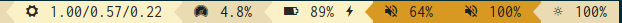

Themes
======

Here are some screenshots of various themes:

.. warning:: Some themes (e.g. all ‘powerline’ themes) require `Font
    Awesome <http://fontawesome.io/>`__ and a powerline-compatible font
    (`powerline-fonts <https://github.com/powerline/fonts>`__.

.. note:: If you want to add your own theme, just drop it into
    `~/.config/bumblebee-status/themes/`

Gruvbox Powerline (``-t gruvbox-powerline``) (contributed by
`TheEdgeOfRage <https://github.com/TheEdgeOfRage>`__):

.. figure:: ../screenshots/themes/powerline-gruvbox.png
   :alt: Gruvbox Powerline

   Gruvbox Powerline

Gruvbox Powerline Light (``-t gruvbox-powerline-light``) (contributed by
`freed00m <https://github.com/freed00m>`__):

   Gruvbox Powerline Light

Solarized Powerline (``-t solarized-powerline``):

.. figure:: ../screenshots/themes/powerline-solarized.png
   :alt: Solarized Powerline

   Solarized Powerline

Gruvbox (``-t gruvbox``):

.. figure:: ../screenshots/themes/gruvbox.png
   :alt: Gruvbox

   Gruvbox

Gruvbox Light (``-t gruvbox-light``) (contributed by
`freed00m <https://github.com/freed00m>`__):

.. figure:: ../screenshots/themes/gruvbox-light.png
   :alt: Gruvbox Light

   Gruvbox Light

Solarized (``-t solarized``):

.. figure:: ../screenshots/themes/solarized.png
   :alt: Solarized

   Solarized

Powerline (``-t powerline``):

.. figure:: ../screenshots/themes/powerline.png
   :alt: Powerline

   Powerline

Greyish Powerline (``-t greyish-powerline``) (contributed by Joshua
Bark):

   Greyish Powerline

Iceberg (``-t iceberg``) (contributed by
`whzup <https://github.com/whzup>`__):

   Iceberg

Iceberg Powerline (``-t iceberg-powerline``) (contributed by
`whzup <https://github.com/whzup>`__):

   Iceberg Powerline

Iceberg Dark Powerline (``-t iceberg-dark-powerline``) (contributed by
`gkeep <https://github.com/gkeep>`__):

.. figure:: ../screenshots/themes/iceberg-dark-powerline.png
   :alt: Iceberg Dark Powerline

   Iceberg Dark Powerline

Iceberg Rainbow (``-t iceberg-rainbow``) (contributed by
`whzup <https://github.com/whzup>`__):

   Iceberg Rainbow

Iceberg Contrast (``-t iceberg-contrast``) (contributed by
`martindoublem <https://github.com/martindoublem>`__):

   Iceberg Contrast

One Dark Powerline (``-t onedark-powerline``) (contributed by
`dillasyx <https://github.com/dillasyx>`__):

   One Dark Powerline

Dracula Powerline (-t dracula-powerline) (contributed by
`xsteadfastx <https://github.com/xsteadfastx>`__):

   Dracula Powerline

Default (nothing or ``-t default``):

.. figure:: ../screenshots/themes/default.png
   :alt: Default

   Default
